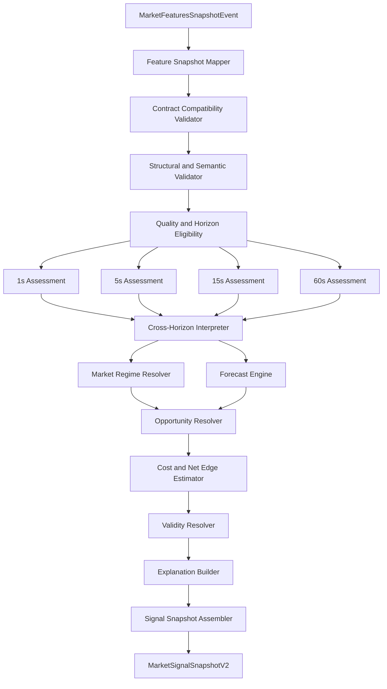

# Market Signal Engine: поточний стан, цільова архітектура та roadmap

**Статус:** канонічний робочий документ / proposed architecture  
**Дата:** 2026-08-08  
**Scope:** тільки `market-signal-engine` та його вхідний/вихідний контракт  
**Поточна лінія:** `mse-signals-v6` у незакоміченому робочому дереві  

## 1. Призначення документа

Цей документ фіксує в одному місці:

- де Signal Engine перебуває зараз за фактичним кодом;
- що вже реалізовано добре і має бути збережено;
- які існують розриви з актуальним Market Feature Service v2;
- до якого кінцевого стану ми прагнемо;
- які архітектурні рішення вважаємо прийнятими;
- у якій послідовності будемо змінювати сервіс;
- за якими критеріями визначатимемо готовність кожного етапу.

Документ не описує внутрішню архітектуру Strategy, Risk або Execution сервісів. Вони згадуються тільки для фіксації межі відповідальності Signal Engine.

## 2. Коротке резюме

Поточний Signal Engine уже не є порожнім skeleton. Він має гексагональну архітектуру, Kafka/Avro integration, domain rules, hard quality/tradability gates, composite setup, deterministic snapshot ID, TTL, DLT і 130 зелених тестів.

Але він усе ще залишається переважно single-window rule engine:

- directional trade flow використовує тільки 5s;
- 15s/60s features не мапляться;
- aggregate quality MFS v2 ігнорується;
- volatility читається через deprecated поле зі старою конфігурацією;
- market bias формується фіксованим discrete consensus `±0.25`;
- output орієнтований на один `MarketSetup`, а не на per-horizon interpretation;
- heuristic confidence поки не має статистичної калібрації;
- expected return і net edge після costs відсутні.

Цільовий Signal Engine має стати:

> Детермінованим, quality-aware, multi-horizon market interpretation, forecasting та opportunity engine, який перетворює один self-contained feature snapshot на per-horizon assessments, calibrated forecasts і cost-aware market opportunities.

Еволюція відбуватиметься поетапно:

```text
MFS v2 compatibility
→ per-horizon eligibility
→ structured market assessments
→ cross-horizon interpretation
→ explainable opportunities
→ replay/calibration
→ probabilistic forecasts
→ cost-aware net edge
```

## 3. Місія і межа відповідальності

### 3.1. На яке питання відповідає Signal Engine

Market Feature Service відповідає:

> Що фактично відбувається на ринку?

Signal Engine відповідає:

> Як інтерпретувати цей стан, що він може означати для наступних горизонтів і чи існує market opportunity?

### 3.2. Що Signal Engine повинен робити

- перевіряти структуру, версію та сумісність feature snapshot;
- враховувати quality, freshness, diagnostics і доступність feature groups;
- визначати eligibility окремо для кожного горизонту;
- оцінювати trade flow, momentum, volatility та order-book evidence;
- інтерпретувати узгодженість і конфлікти між горизонтами;
- класифікувати market regime;
- формувати market opportunities;
- оцінювати evidence strength, а після калібрації — probability/confidence;
- визначати validity і typed invalidators;
- оцінювати gross/net edge після появи execution context;
- публікувати typed, explainable і versioned signal snapshot;
- гарантувати deterministic replay для однакового input/config/model.

### 3.3. Чого Signal Engine не повинен робити

- знати баланс рахунку;
- знати поточну позицію або PnL;
- визначати quantity або leverage;
- ухвалювати остаточне рішення `ENTER/HOLD/EXIT`;
- керувати stop-loss/take-profit;
- створювати біржові ордери;
- залежати від конкретної біржі;
- приховано накопичувати rolling market history, яку вже обчислив MFS.

Signal Engine оцінює ринок. Downstream strategy вирішує, що робити з оцінкою.

## 4. Поточний стан за кодом

### 4.1. Репозиторій і збірка

Стан на 2026-08-08:

- branch: `master`, синхронний з `origin/master`;
- останній commit: `678a0c5` від 2026-06-27;
- 29 змінених tracked-файлів;
- 1 видалений tracked-файл (`RegimeSignalRule`);
- 14 нових untracked-файлів;
- tracked diff приблизно `+1973 / -261` рядків;
- `./gradlew clean build` — `BUILD SUCCESSFUL`;
- 130 тестів, 0 failures, 0 errors, 0 skipped;
- executable `app.jar` успішно збирається.

Локальний Kafka/Schema Registry під час аудиту не працював через незапущений Docker Desktop, тому end-to-end Kafka flow не підтверджений.

### 4.2. Модулі

```text
application
├── domain models
├── signal rules
├── engine/aggregation services
├── input/output ports
└── application handler

infrastructure/app
├── Spring Boot entrypoint
├── bean wiring
└── configuration properties

infrastructure/event-adapter
├── Kafka consumer
├── Avro mappers
├── DLT/error handling
└── Kafka publisher
```

Гексагональну межу слід зберегти: domain/application не повинні залежати від Spring, Kafka або Avro.

### 4.3. Поточний runtime pipeline

```text
MarketFeaturesSnapshotEvent
→ MarketFeaturesSnapshotAvroMapper
→ MarketFeaturesSnapshotValidator
→ QualitySignalRule
→ SpreadSignalRule + VolatilitySignalRule
→ TradeFlowSignalRule + OrderBookSignalRule
→ DefaultCompositeSignalRule
→ DirectionalReduction
→ SignalAggregator
→ SetupResolver + SignalValidityResolver
→ MarketSignalSnapshotAvroMapper
→ synchronous Kafka publish
```

Ключова реалізація: [`DefaultMarketSignalEngine`](../application/src/main/java/com/trading/marketsignalengine/application/domain/service/DefaultMarketSignalEngine.java).

### 4.4. Що вже реалізовано добре

#### Hard phase gates

Engine має три фази:

1. data quality;
2. spread/volatility tradability;
3. directional evidence і composite setup.

`RISK_OFF` після quality або tradability gate припиняє directional evaluation.

#### Null safety

- missing quality не трактується як tradable;
- missing spread не трактується як wide/normal;
- missing volatility не трактується як normal;
- structurally invalid snapshot валиться fail-fast;
- semantically invalid feature values створюють explicit `RISK_OFF`.

#### Нормалізований trade flow

Поточний worktree вже перейшов від raw `signedTradeFlow5s` до normalized `signedFlowImbalance5s` із:

- buy threshold `+0.15`;
- sell threshold `-0.15`;
- minimum `tradeCount5s = 10`;
- strength/confidence як функцією magnitude.

#### Setup і validity

Додані:

- `MarketSetup`;
- `SetupResolver`;
- `SignalValidity`;
- `SignalValidityResolver`.

Поточні TTL:

- directional microstructure setup — 2s;
- risk-off — 5s;
- neutral — 1s.

#### Deterministic ID

Signal snapshot ID детерміновано залежить від:

```text
sourceFeatureSnapshotId | signalSetVersion
```

Це дає стабільний downstream deduplication key під час retry/replay.

#### Test foundation

Тести добре покривають:

- quality/spread/volatility/book/flow rules;
- composite setup;
- directional reduction;
- aggregation;
- setup і validity resolvers;
- structural validator;
- Avro input/output mapping.

### 4.5. Поточні обмеження і дефекти

#### Discrete directional reduction

[`DirectionalReduction`](../application/src/main/java/com/trading/marketsignalengine/application/domain/service/DirectionalReduction.java) використовує:

```text
BUY_PRESSURE        +0.25
ORDER_BOOK_BULLISH  +0.25
SELL_PRESSURE       -0.25
ORDER_BOOK_BEARISH  -0.25
```

Threshold directional bias дорівнює `±0.35`. Тому один base signal не формує directional bias.

Це корисний safety consensus, але він не враховує:

- horizon;
- confidence/strength;
- activity;
- feature quality;
- volatility regime;
- context/trigger conflict;
- historical predictive value.

#### Один setup

Поточний snapshot має один `MarketSetup`. Цього недостатньо для представлення:

- різних горизонтів;
- одночасного short trigger і bullish context;
- opportunity без достатнього net edge;
- кількох opportunity families.

#### Directional leakage усередині третьої фази

Якщо перше directional rule уже додало bullish/bearish evidence, а наступне directional rule повернуло invalid-feature `RISK_OFF`, попереднє evidence може залишитися у published signal list. Bias буде `RISK_OFF`, score — `0`, setup — `NONE`, але class-level інваріант «directional signals не публікуються у no-trade snapshot» виконується не повністю.

#### Publisher blocking

[`MarketSignalSnapshotPublisher`](../infrastructure/event-adapter/src/main/java/com/trading/marketsignalengine/event/publisher/MarketSignalSnapshotPublisher.java) виконує:

```java
kafkaTemplate.send(topic, key, event).join();
```

Це добре поширює publish failure до listener error handler, але може блокувати consumer thread до Kafka producer timeout. Signal Engine поки не має явного fail-fast producer budget, аналогічного MFS.

#### Spring Kafka listener configuration

Listener factory створюється вручну, без `ConcurrentKafkaListenerContainerFactoryConfigurer`. Через це стандартні `spring.kafka.listener.*` properties можуть застосовуватися не повністю. Під час smoke-перевірки `spring.kafka.listener.auto-startup=false` не зупинив custom listener.

#### Відсутні integration tests

Немає підтверджених тестів для:

- повного Spring context;
- consume → evaluate → publish;
- live Schema Registry compatibility;
- Kafka retries/DLT;
- producer timeout/failure;
- duplicated Kafka input;
- application shutdown/restart.

## 5. Актуальний input від MFS v2

Market Feature Service уже публікує більше інформації, ніж використовує Signal Engine.

### 5.1. Metadata і quality

- `evaluationTs`;
- `computedTs`;
- `featureSetVersion`;
- `configHash`;
- `triggerSource`;
- source state/versions;
- aggregate status `OK / DEGRADED / UNSAFE / NO_DATA`;
- quality reasons;
- `futureEventDetected`;
- `warmingUp`;
- failed feature groups.

### 5.2. Multi-horizon trade flow

Для `1s / 5s / 15s / 60s`:

- buy/sell aggressive volume;
- total aggressive volume;
- signed trade flow;
- normalized flow imbalance;
- trade count;
- valid quantity count;
- aggressive trade count;
- unknown side count;
- trade intensity;
- average trade size;
- VWAP.

### 5.3. Short-term regime

- realized volatility bps `1s / 5s / 15s / 60s`;
- price change bps `5s / 15s / 60s`;
- high-low range bps `60s`;
- last trade distance to mid bps.

Актуальний feature contract: [`MarketFeaturesSnapshotEvent.avsc`](../../trading-schemas/src/main/avro/com/trading/contracts/feature/snapshot/MarketFeaturesSnapshotEvent.avsc).

## 6. Розрив між MFS v2 і поточним Signal Engine

| Область | MFS v2 | Signal Engine зараз | Ризик |
|---|---|---|---|
| Kafka topic | `market.feature.snapshot.v1` | `market.features.snapshot.v1` | Сервіси не з'єднані за default config |
| Trade flow | 1/5/15/60s | мапляться лише 1/5s | Втрата multi-horizon context |
| Regime | volatility/price change 1–60s | deprecated volatility 1s | Семантична несумісність |
| Volatility units | log-return bps | старий threshold `0.01` | Некалібрований risk gate |
| Quality status | OK/DEGRADED/UNSAFE/NO_DATA | ігнорується | Partial/broken snapshot може трактуватися неправильно |
| Quality reasons | typed/open reason set | ігноруються | Немає per-cause eligibility |
| Diagnostics | failed feature groups | ігноруються | Failed calculator може виглядати як neutral feature |
| Window warm-up | explicit | ігнорується | Null long windows без коректної eligibility |
| History gap | explicit | ігнорується | Неповні windows можуть використовуватися |
| `evaluationTs` | deterministic as-of time | ігнорується | Неправильна age/validity semantics |
| `configHash` | lineage | ігнорується | Неможливо довести config compatibility |
| `triggerSource` | event/timer source | ігнорується | Втрата replay/diagnostic context |
| Output | потрібен multi-horizon result | один bias/setup | Інформаційна втрата |

До усунення цього розриву поточний Signal Engine не слід вважати сумісним із MFS v2 для live execution.

## 7. Прийняті архітектурні рішення

### Рішення 1. Stateless core

Перша цільова версія Signal Engine залишається stateless:

```text
same feature snapshot
+ same signal configuration
+ same model artifact
= same signal snapshot
```

Engine не відновлює власні rolling windows і не залежить від прихованого previous signal state.

### Рішення 2. Stability layer не входить у перший V2 milestone

Hysteresis, persistence і cooldown поки не додаються у core. Перший рівень стабільності забезпечують:

- multi-horizon features;
- dead zones;
- activity gates;
- cross-horizon alignment;
- validity;
- downstream strategy confirmation.

Якщо replay покаже надмірний signal churn, stateful `OpportunityLifecycleStabilizer` може бути доданий окремим, явним і replayable етапом після stateless assessment.

### Рішення 3. Market bias — summary, а не головний продукт

`marketBias` і discrete consensus можна зберегти для compatibility та швидкого UI summary. Головними результатами стають:

- horizon assessments;
- forecasts;
- opportunities;
- eligibility;
- net edge.

### Рішення 4. Evidence strength не дорівнює confidence

До історичної калібрації rule engine публікує:

- `directionScore`;
- `evidenceStrength`;
- `alignmentScore`;
- `dataQuality`;
- `uncertainty` як heuristic/structural estimate.

Поле `confidence`/`probability` використовується лише після перевірки empirical calibration.

### Рішення 5. No-edge, ineligible і risk-off — різні результати

- `INELIGIBLE` — немає надійних даних для оцінювання;
- `RISK_OFF` — умови структурно небезпечні;
- `NO_EDGE` — дані валідні, але opportunity немає;
- `CONFLICTED` — evidence/horizons суперечать одне одному;
- `ACTIVE_OPPORTUNITY` — є market opportunity.

Mixed flow не є автоматично risk-off: він може бути лише відсутністю momentum edge.

### Рішення 6. Quality обробляється per horizon і per feature group

Global hard block:

- `UNSAFE`;
- `NO_DATA`;
- unsupported contract/config;
- structural corruption.

Selective degradation/block:

- `WARMING_UP`;
- `CALCULATOR_FAILURE`;
- `TRADE_HISTORY_GAP`;
- `INCOMPLETE_BOOK`;
- soft `STALE_TRADES`;
- partial source impairment.

### Рішення 7. Core output — typed

Core semantics не зберігається лише в `Map<String,String>`. Attributes залишаються для diagnostics/extensions, але eligibility, horizon, opportunity, forecast, reasons, validity і lineage мають typed fields.

### Рішення 8. Opportunity замість торгової команди

Signal Engine публікує `MarketOpportunity`, а не `BUY/SELL` чи фінальний strategy decision.

### Рішення 9. Weights завжди versioned і перевіряються replay

Heuristic weights допустимі як baseline, але:

- не є universal truth;
- зберігаються у versioned configuration;
- можуть бути різними per horizon;
- не називаються calibrated confidence;
- порівнюються з простими baseline-моделями.

### Рішення 10. Validity залежить від horizon і age

Fixed TTL недостатньо. Remaining validity має враховувати:

```text
target horizon
- feature age
- signal processing latency
- delivery/safety buffer
- regime/quality adjustment
```

Пізніше validity калібрується за empirical alpha decay.

## 8. Цільова внутрішня архітектура



### 8.1. Input layer

- `MarketFeaturesSnapshotAvroMapper`;
- `FeatureContractCompatibilityValidator`;
- `MarketFeaturesSnapshotValidator`;
- `FeatureGroupAvailabilityResolver`.

### 8.2. Quality layer

- `QualityAssessmentResolver`;
- `HorizonEligibilityResolver`;
- typed `EligibilityStatus` і `EligibilityReason`.

### 8.3. Evidence layer

- `FlowAssessmentEvaluator`;
- `MomentumAssessmentEvaluator`;
- `VolatilityAssessmentEvaluator`;
- `BookAssessmentEvaluator`;
- `ExecutionAssessmentEvaluator` після появи відповідних features.

Кожен evaluator відповідає на одне питання і повертає structured assessment, а не фінальний setup.

### 8.4. Interpretation layer

- `CrossHorizonInterpreter`;
- `MarketRegimeResolver`;
- `DirectionalEvidenceAggregator`;
- `IndependentEvidenceConsensus` для explainability/compatibility.

### 8.5. Forecast layer

Послідовна еволюція:

1. `RuleBasedForecastBaseline`;
2. statistical linear/logistic baseline;
3. quantile forecast;
4. calibrated gradient boosting/multi-horizon model;
5. champion/challenger model selection.

### 8.6. Opportunity layer

- `OpportunityResolver`;
- `ExpectedCostEstimator`;
- `NetEdgeCalculator`;
- `OpportunityEligibilityPolicy`.

### 8.7. Output layer

- `SignalValidityResolver`;
- `SignalExplanationBuilder`;
- `MarketSignalSnapshotAssembler`;
- `MarketSignalSnapshotV2AvroMapper`;
- Kafka publisher.

## 9. Цільова domain model

### 9.1. Quality assessment

```text
QualityAssessment
├── sourceStatus
├── overallEligibility
├── reasons[]
├── failedFeatureGroups[]
├── futureEventDetected
├── featureAgeMs
└── horizonEligibility[]
```

Приклад:

```text
1s  → ELIGIBLE
5s  → ELIGIBLE
15s → ELIGIBLE_DEGRADED
60s → INELIGIBLE: WARMING_UP
```

### 9.2. Horizon assessment

```text
HorizonAssessment
├── horizon
├── eligibility
├── flowAssessment
├── momentumAssessment
├── volatilityAssessment
├── bookAssessment
├── directionScore
├── evidenceStrength
├── supportingFactors[]
├── contradictingFactors[]
└── reasonCodes[]
```

### 9.3. Cross-horizon assessment

```text
CrossHorizonAssessment
├── state
├── dominantDirection
├── contextDirection
├── triggerDirection
├── alignmentScore
├── conflictType
└── explanation
```

Початкові states:

- `ALIGNED_BULLISH`;
- `ALIGNED_BEARISH`;
- `SHORT_TERM_PULLBACK`;
- `POSSIBLE_REVERSAL`;
- `MIXED`;
- `NEUTRAL`;
- `INSUFFICIENT_DATA`.

### 9.4. Forecast

Після empirical calibration:

```text
Forecast
├── horizonMs
├── expectedReturnBps
├── probabilityUp
├── probabilityDown
├── probabilityFlat
├── q10ReturnBps
├── q50ReturnBps
├── q90ReturnBps
├── expectedVolatilityBps
├── uncertainty
└── calibrationVersion
```

### 9.5. Market opportunity

```text
MarketOpportunity
├── opportunityId
├── type
├── side
├── targetHorizonMs
├── evidenceStrength
├── confidence
├── grossEdgeBps
├── expectedCostBps
├── netEdgeBps
├── uncertainty
├── validUntil
├── supportingFactors[]
├── contradictingFactors[]
└── invalidators[]
```

Початкові opportunity types:

- `MOMENTUM_CONTINUATION`;
- `NO_EDGE`;
- `RISK_OFF`.

Наступні, тільки після replay validation:

- `MOMENTUM_EXHAUSTION`;
- `PULLBACK`;
- `BREAKOUT`;
- `MEAN_REVERSION`;
- `LIQUIDITY_SHOCK`.

### 9.6. Typed invalidator

Машинна логіка не залежить від текстових reason strings:

```text
OpportunityInvalidator
├── code
├── horizonMs
├── feature
├── operator
└── threshold
```

Людський текст залишається в explanation.

## 10. Цільовий output contract

```text
MarketSignalSnapshotV2
├── metadata
├── sourceReference
├── qualityAssessment
├── horizonAssessments[]
├── crossHorizonAssessment
├── marketRegime
├── forecasts[]
├── opportunities[]
├── eligibility
├── summary
└── diagnostics
```

### 10.1. Обов'язкове lineage

- `signalSnapshotId`;
- `signalContractVersion`;
- `signalSetVersion`;
- `signalConfigHash`;
- `modelVersion` і `modelArtifactHash`, якщо використовується model;
- `sourceFeatureEventId`;
- `sourceFeatureSetVersion`;
- `sourceFeatureConfigHash`;
- `sourceFeatureEvaluationTs`;
- `sourceTriggerSource`;
- `evaluatedAt`;
- `createdAt`;
- `validUntil`.

### 10.2. Compatibility summary

Для UI/старих consumers можна тимчасово залишити:

- `marketBias`;
- `marketBiasScore` або `independentEvidenceConsensus`;
- один projected setup.

Але ці поля є projections із V2 domain, а не source of truth.

## 11. Правила multi-horizon interpretation

### 11.1. Роль горизонтів

- `1s` — immediate state і execution timing evidence;
- `5s` — короткий trigger;
- `15s` — short-term direction/persistence;
- `60s` — local microstructure context.

Одна universal weight vector не використовується. Aggregation залежить від target forecast horizon.

### 11.2. Flow assessment

Враховує per horizon:

- normalized signed flow imbalance;
- trade count;
- aggressive trade count;
- unknown-side ratio;
- trade intensity;
- total aggressive volume;
- coverage і quality.

Початкові states:

- `BULLISH`;
- `BEARISH`;
- `NEUTRAL`;
- `MIXED`;
- `INSUFFICIENT_ACTIVITY`;
- `UNAVAILABLE`.

### 11.3. Momentum assessment

Враховує:

- price change `5s/15s/60s`;
- VWAP context;
- last trade distance to mid;
- flow/price confirmation;
- flow/price divergence.

Початкові states:

- `CONFIRMED_BULLISH`;
- `CONFIRMED_BEARISH`;
- `FLAT`;
- `DIVERGENT`;
- `POSSIBLE_ABSORPTION`;
- `POSSIBLE_EXHAUSTION`;
- `UNAVAILABLE`.

Divergence не перетворюється автоматично на протилежний directional signal.

### 11.4. Volatility assessment

Volatility — risk/regime context, а не directional vote.

Початкові states:

- `LOW`;
- `NORMAL`;
- `HIGH`;
- `EXTREME`;
- `UNKNOWN`.

High volatility не є автоматично no-trade. Вона впливає на uncertainty, validity, required edge і eligibility. Hard block застосовується лише за explicit unsafe/extreme policy.

### 11.5. Book assessment

Враховує:

- top1/top5 imbalance;
- microprice offset;
- spread;
- liquidity asymmetry;
- source book trust.

Результат:

- supports direction;
- contradicts direction;
- neutral;
- unavailable/unsafe.

Book evidence не створює opportunity самостійно.

### 11.6. Початковий momentum opportunity

Conceptual long continuation:

```text
required horizons eligible
+ bullish 60s context
+ bullish 15s persistence
+ bullish/confirming 5s trigger
+ no strong adverse 1s reversal
+ momentum confirmation
+ acceptable volatility policy
+ valid/trusted market state
+ acceptable spread/cost
= MOMENTUM_CONTINUATION LONG candidate
```

Точні thresholds/weights не вважаються універсальними й мають бути versioned та replay-tested.

## 12. Validity semantics

### 12.1. Визначення

`validUntil` — exclusive absolute timestamp, після якого snapshot не може використовуватися як актуальна market interpretation.

### 12.2. Розрахунок

```text
baseValidity(targetHorizon, opportunityType)
- sourceFeatureAge
- signalEvaluationLatency
- publicationSafetyBuffer
- regime/qualityAdjustment
= remainingValidity
```

Якщо remaining validity не позитивна, opportunity не публікується як active.

### 12.3. Alpha decay

Після накопичення replay/paper даних base validity визначається не вручну, а за empirical decay конкретного opportunity type/horizon.

## 13. Explainability

Кожен assessment/opportunity повинен містити:

- typed reason codes;
- supporting factors;
- contradicting factors;
- eligibility/risk reasons;
- actual observed values;
- applied thresholds/config version;
- rule/model contributions.

Приклад:

```text
Opportunity: MOMENTUM_CONTINUATION LONG / 15s

Supporting:
- FLOW_15S_BULLISH: +0.34
- FLOW_60S_BULLISH: +0.19
- PRICE_CHANGE_15S_POSITIVE: +4.8 bps
- MICROPRICE_SUPPORTS_LONG: +0.6 bps

Contradicting:
- FLOW_1S_WEAK
- VOLATILITY_5S_EXPANDING

Eligibility:
- QUALITY_OK
- SPREAD_ACCEPTABLE
- REQUIRED_WINDOWS_COVERED
```

Text summary потрібен людині. Typed factors потрібні tests, UI, analytics і calibration pipeline.

## 14. Roadmap реалізації

### Фаза 0. Safety checkpoint поточного V6

#### Роботи

1. Розділити поточне незакомічене робоче дерево на логічні commits.
2. Зафіксувати `mse-signals-v6` як baseline.
3. Зберегти 130 зелених тестів як regression baseline.
4. Не додавати нові signal families у стару модель.
5. Задокументувати current output contract і відомі інваріанти.

#### Definition of Done

- worktree changes мають зрозумілу commit history;
- current build відтворюється;
- V6 можна порівнювати з V2 у replay/shadow;
- є безпечна точка повернення.

### Фаза 1. Повна input compatibility з MFS v2

#### Роботи

1. Уніфікувати default Kafka topic.
2. Розширити input domain models.
3. Замапити 15s/60s trade flow.
4. Замапити realized volatility і price change.
5. Замапити aggregate quality, reasons і diagnostics.
6. Замапити `evaluationTs`, `configHash`, `triggerSource`, source state.
7. Прибрати залежність domain logic від deprecated volatility field.
8. Ввести feature version/config compatibility validator.
9. Невідома версія/config combination — fail closed.
10. Додати consumer contract tests для кожного нового поля і null semantics.

#### Definition of Done

- Signal Engine без втрат читає актуальний MFS v2 snapshot;
- unsupported input не створює правдоподібний output;
- нові units підтверджені tests;
- mapper і domain contract однозначні;
- topic defaults узгоджені.

### Фаза 2. Quality assessment і horizon eligibility

> Статус: пункти 1–8 реалізовані як pure domain layer в Етапі 3 (§15, «Етап 3»); пункт 9
> (directional leakage у V1 no-trade path) лишається відкритим і не входить в Етап 3.

#### Роботи

1. Створити `QualityAssessment`.
2. Створити `HorizonEligibility`.
3. Створити typed eligibility reasons.
4. Реалізувати global hard gate.
5. Реалізувати per-feature/per-horizon degradation.
6. Враховувати warming-up і history gaps.
7. Враховувати failed feature groups.
8. Додати feature snapshot age і processing latency checks.
9. Виправити directional leakage у no-trade path.

#### Definition of Done

- `null` ніколи не стає neutral zero;
- `UNSAFE/NO_DATA` завжди block;
- short horizons можуть залишатися eligible під час 60s warm-up;
- failed calculator блокує лише залежні assessments або global flow за policy;
- no-trade snapshot не містить суперечливого actionable evidence.

### Фаза 3. Structured assessment model

#### Роботи

1. Створити `FlowAssessment`.
2. Створити `MomentumAssessment`.
3. Створити `VolatilityAssessment`.
4. Створити `BookAssessment`.
5. Створити `HorizonAssessment`.
6. Відокремити evaluator outputs від старого `MarketSignal` enum list.
7. Усі reasons/observations зробити typed.
8. Залишити V1 projection adapter для compatibility.

#### Definition of Done

- кожна evidence family має окрему domain model;
- evaluators можна тестувати незалежно;
- немає фінального BUY/SELL усередині base evaluator;
- assessments повністю explainable.

### Фаза 4. Flow Alignment V1

> Статус: пункти 1–3 і 6 реалізовані як pure domain layer в Етапі 4 (§15, «Етап 4») — per-horizon
> flow evidence з activity / unknown-side gates і boundary tests, horizon-specific thresholds у
> явній versioned `FlowAssessmentPolicy` (без production calibration і Spring configuration);
> пункти 4 (production configuration) і 5 (aligned / mixed / pullback / reversal) лишаються відкритими
> і належать cross-horizon етапу.

#### Роботи

1. Оцінити flow per horizon.
2. Додати activity/coverage gates.
3. Врахувати aggressive/unknown-side quality.
4. Ввести horizon-specific thresholds/weights у configuration.
5. Реалізувати aligned/mixed/pullback/reversal evidence states.
6. Додати boundary/property tests.

#### Definition of Done

- окремий 1s print не створює strong opportunity;
- 1/5/15/60s alignment детермінований;
- low activity explicit, не neutral;
- усі heuristic weights versioned.

### Фаза 5. Momentum, volatility і book assessments

#### Роботи

1. Додати price-change confirmation.
2. Додати flow/price divergence.
3. Додати volatility expansion/contraction/regime.
4. Перекалібрувати volatility policy в bps.
5. Додати book support/contradiction.
6. Відокремити spread gate від directional book evidence.
7. Не дозволяти book-only opportunity.

#### Definition of Done

- regime не голосує механічно за direction;
- divergence є окремим state;
- high volatility не завжди автоматично no-trade;
- book є confirmation/context;
- missing group обробляється через eligibility.

### Фаза 6. Cross-horizon interpreter і перші opportunities

#### Роботи

1. Створити `CrossHorizonInterpreter`.
2. Створити `MarketRegimeResolver`.
3. Створити `OpportunityResolver`.
4. Реалізувати тільки:
   - momentum continuation long;
   - momentum continuation short;
   - no edge;
   - risk off.
5. Публікувати `evidenceStrength`, а не некалібрований confidence.
6. Додати supporting/contradicting evidence.
7. Додати typed invalidators.

#### Definition of Done

- один feature не створює opportunity;
- context і trigger розділені;
- conflicting horizons explicit;
- opportunities мають малий, зрозумілий taxonomy;
- кожен opportunity відтворюється з snapshot/config.

### Фаза 7. Validity, explanation і V2 output contract

#### Роботи

1. Реалізувати horizon/age-aware validity.
2. Створити `SignalExplanationBuilder`.
3. Створити `MarketSignalSnapshotV2` domain.
4. Додати Avro V2 contract у `trading-schemas`.
5. Публікувати V2 в окремий topic.
6. Залишити V2 → V1 projection на час міграції.
7. Додати contract compatibility CI tests.

#### Definition of Done

- V2 core fields typed;
- lineage повне;
- expired opportunity не публікується active;
- однаковий input/config дає byte-stable semantic output;
- V1 і V2 можуть працювати паралельно у shadow mode.

### Фаза 8. Signal replay і empirical evaluation

#### Роботи

1. Створити in-process signal replay harness:

   ```text
   List<MarketFeaturesSnapshot>
   → Signal Engine
   → List<MarketSignalSnapshotV2>
   ```

2. Додати golden signal snapshots.
3. Порівнювати V6/V2/alternative configs.
4. Вимірювати opportunity frequency, churn і lifetime.
5. Побудувати executable-price labels per horizon.
6. Врахувати fees, spread, latency і slippage.
7. Використовувати time-based walk-forward splits із захистом від overlap/leakage.
8. Зберігати всі tested configurations/models для контролю selection bias.

#### Definition of Done

- Signal Engine replay deterministic;
- є чесні outcome labels;
- thresholds оцінюються out-of-sample;
- відомі false positives per instrument/horizon/regime;
- validity можна пов'язати з empirical alpha decay.

### Фаза 9. Calibrated forecast layer

#### Роботи

1. Додати прості statistical baselines.
2. Навчати/оцінювати окремо per horizon.
3. Додати quantile forecasts.
4. Калібрувати probabilities.
5. Ввести immutable model artifacts.
6. Додати champion/challenger/shadow inference.
7. Rule assessments залишити для explainability і fallback.

#### Definition of Done

- `confidence` має empirical interpretation;
- forecasts стабільні out-of-sample;
- model lineage повне;
- unknown/incompatible model artifact fail closed;
- model можна відтворити і порівняти з rule baseline.

### Фаза 10. Cost-aware opportunity engine

#### Роботи

1. Спожити MFS execution context, коли він з'явиться.
2. Оцінювати cost per standardized notional bucket.
3. Розраховувати gross/net edge.
4. Додати uncertainty/safety buffer.
5. Активувати opportunity тільки за позитивного required net edge.
6. Калібрувати opportunity threshold за replay/paper outcomes.

#### Definition of Done

```text
netEdgeBps = expectedGrossMoveBps
           - spreadCostBps
           - feesBps
           - expectedSlippageBps
           - uncertaintyBufferBps
```

Opportunity є active тільки коли net edge перевищує versioned minimum edge policy.

### Фаза 11. Production hardening

#### Роботи

1. Налаштувати fail-fast Kafka producer budgets.
2. Підключити listener factory через Boot configurer або явно підтримати всі listener properties.
3. Додати Spring context test.
4. Додати Kafka integration tests.
5. Перевірити retry/DLT/idempotency paths.
6. Додати latency/freshness/rule/model metrics.
7. Додати configuration rollout validation.
8. Pin dependencies і Docker versions.
9. Додати CI, coverage і static analysis.

#### Definition of Done

- broker/registry outage має bounded failure behavior;
- duplicate input дає stable output ID;
- observability показує причини ineligible/no-edge/risk-off;
- configuration/model rollout можна безпечно відкотити;
- end-to-end tests виконуються в CI.

## 15. Порядок найближчих практичних робіт

> **Актуальний операційний план:** [path-to-paper-trading.md](path-to-paper-trading.md)
> (прийнято 2026-08-08). Він уточнює порядок нижче: replay harness переноситься на
> початок (даталейк-джоба вже пише всі топіки), перший milestone — paper trading на
> V1 контракті, рішення по топіку/volatility/quality зафіксовані в його §8.

Перший реалізаційний backlog:

1. Зафіксувати V6 baseline у логічних commits.
2. Уніфікувати feature topic.
3. Оновити input domain під MFS v2.
4. Оновити Avro input mapper.
5. Додати aggregate quality/reasons/diagnostics.
6. Перейти з deprecated volatility на `realizedVolatilityBps*`.
7. Додати `evaluationTs`, `configHash`, `triggerSource` і source state.
8. Додати compatibility validator.
9. Додати per-horizon eligibility.
10. Виправити directional leakage.
11. Створити assessment domain models.
12. Реалізувати Flow Alignment V1.
13. Реалізувати Momentum/Volatility/Book assessments.
14. Реалізувати Cross-Horizon Interpreter.
15. Реалізувати перші momentum opportunities.
16. Спроєктувати V2 Avro output.
17. Запустити V2 у shadow mode.
18. Побудувати replay/calibration pipeline.

### Етап 1. Стабілізація поточного V1 engine — ✅ реалізовано 2026-08-23

Мета етапу — зробити V1 детермінованим, однаковим для live/replay і надійним щодо invalid input
та Kafka failures, **без зміни торгової семантики** (`mse-signals-v8`, thresholds, V1 output
schema, golden outputs, metrics — незмінні). Зроблено:

1. **Shared validated evaluator.** `ValidatedMarketSignalEvaluator` (validate → evaluate з explicit
   `evaluatedAt`) використовують і `MarketSignalHandleService` (live, `Instant.now(clock)`), і
   `ReplayHarness` (explicit resolver). Replay більше не обходить `MarketFeaturesSnapshotValidator`;
   однаковий input + `evaluatedAt` + config ⇒ однаковий snapshot або однакова validation exception.
   `StandardSignalEngine` лишається єдиним wiring.
2. **MFS v2 compatibility validator** (пункт 8 backlog): identity/lineage (`configHash`),
   `featureSetVersion` allowlist + `schemaVersion = 1`, `evaluationTs`/`computedAt`/`eventTime`,
   `triggerSource ∈ {ORDER_BOOK_L2_SNAPSHOT, TRADE, TIMER}` (TIMER: eventTime epoch zero дозволено),
   `evaluationTs == eventTime` для market-event triggers, чесний `futureEventDetected`, consistency
   aggregate status ↔ flags/reasons/diagnostics за `FeatureQualityCalculator`. Contract contradiction →
   DLT; DEGRADED/UNSAFE/NO_DATA/warm-up/stale/failed calculator — валідний input → V1 no-trade.
3. **Availability normalization (input side)**: `FeatureAvailabilityResolver` → `TradeFlowAvailability`
   (1S/5S/15S/60S: AVAILABLE / WARMING_UP / UNAVAILABLE / UNTRUSTED / FAILED; null ≠ zero;
   precedence FAILED → UNTRUSTED → WARMING_UP → UNAVAILABLE → AVAILABLE). Фундамент для Фази 2
   (пункт 9 backlog), trading logic ще не використовує.
4. **Kafka reliability**: hierarchy `request.timeout.ms 3000 < delivery.timeout.ms 5000 <
   publish-timeout 6500` з startup validation (`PublishTimeoutHierarchy`), `enable.idempotence=true`,
   `acks=all`; at-least-once і можливі duplicates після ambiguous timeout задокументовано
   (dedup на `signalSnapshotId`); integration test publish failure → retry (точна кількість спроб) → DLT.
5. **Fail-fast**: publisher кидає на null snapshot / blank topic / non-positive timeout; invalid
   publisher configuration ламає startup; handle service не ковтає validation/evaluation failures.

Поза етапом (наступний етап — V2 domain model): MarketInterpretation domain, V2 mapper/topic,
per-horizon assessments, cross-horizon interpretation, opportunity resolver.

### Етап 2. V2 domain foundation — Market Interpretation domain model — ✅ реалізовано 2026-08-23

Мета етапу — спроєктувати мову та інваріанти нового канонічного engine **без evaluation logic**:
чиста, immutable, typed внутрішня domain model multi-horizon market interpretation, що відповідає
V2 контракту `com.trading.contracts.signal.MarketInterpretationSnapshotEvent` (trading-schemas 1.1.0)
і не залежить від Avro, Kafka, Spring, generated contract classes, infrastructure, `Clock` або
`Instant.now()`. V1 лишається regression baseline: `mse-signals-v8`, thresholds, V1 output contract,
golden outputs, Stage 1 Kafka semantics і metrics — незмінні.

Зроблено (пакет `application/.../domain/interpretation`, плюс `domain/model/MarketHorizon`):

1. **Один канонічний horizon type.** `MarketHorizon` (`H1S/H5S/H15S/H60S`, `wireValue()` `1S/5S/15S/60S`,
   `duration()`, `canonicalOrder()` завжди `1S → 5S → 15S → 60S`, `fromWireValue` fail closed).
   `FeatureWindowHorizon` видалено; `FeatureAvailabilityResolver` / `TradeFlowAvailability` /
   `FeatureWindowAvailability` переведені на `MarketHorizon` механічно — trade-flow-specific вибір
   window і nullability counters (`tradeFlowWindowOf`, `hasNullableCounts`) лишилися всередині
   resolver; Stage 1 availability semantics не змінені (той самий тест-набір + 1 новий тест).
2. **Typed vocabulary (окремо від V1 enums).** `InterpretationQualityStatus` (OK/DEGRADED/BLOCKED/
   NO_DATA/UNKNOWN), `HorizonEligibilityStatus` (ELIGIBLE/WARMING_UP/UNAVAILABLE/UNTRUSTED/FAILED/UNKNOWN),
   `InterpretationDirection` (BULLISH/BEARISH/NEUTRAL/MIXED/UNKNOWN), `EvidenceDimension`
   (FLOW/MOMENTUM/VOLATILITY/BOOK), `EvidenceAvailabilityStatus`, `CrossHorizonAlignment`,
   `OpportunityStatus`, `OpportunityType`, `OpportunitySide` (LONG/SHORT/NONE — не BUY/SELL),
   `MarketRegime`. **Availability ≠ eligibility**: `FeatureAvailabilityStatus` — факт про input
   window, `HorizonEligibilityStatus` — policy verdict про горизонт; AVAILABLE input не робить
   горизонт ELIGIBLE сам по собі. **UNKNOWN ≠ NEUTRAL** скрізь.
3. **Value objects.** `ReasonCode` (typed, non-blank, `UPPER_SNAKE_CASE`, value equality; колекції
   reason codes immutable, без null, duplicates → fail-fast, insertion order); `EvidenceStrength`
   (`BigDecimal` у `[0,1]`, без double/NaN, нормалізований deterministic `toPlainString`; absence =
   відсутній об'єкт, ніколи не `0`; не probability і не confidence).
4. **Lineage.** `FeatureLineage` (sourceFeatureEventId / SchemaVersion / SetVersion / ConfigHash /
   sourceEvaluationAt / sourceComputedAt / sourceTriggerSource; non-blank, schema > 0, timestamps
   positive; `evaluationAt ≤ computedAt` свідомо не вимагається — upstream чесно повідомляє
   future-event/clock-skew) + pure `FeatureLineageFactory.from(MarketFeaturesSnapshot)` (lossless, без
   Clock, не створює неповний lineage); `InterpretationLineage` (interpretationVersion,
   interpretationConfigHash: non-blank, placeholder-значення відхиляються).
5. **Assessment model з інваріантами у конструкторах/factories.** `InterpretationQuality`
   (OK ⇒ eligible=true; BLOCKED/NO_DATA/UNKNOWN ⇒ false; DEGRADED — policy, модель не промотує в BLOCKED),
   `HorizonEligibility`, `EvidenceAssessment` (non-AVAILABLE ⇒ direction UNKNOWN, strength absent),
   `HorizonAssessment` (унікальні dimensions у canonical order; non-ELIGIBLE ⇒ UNKNOWN, без strength /
   regime / AVAILABLE evidence; factories `eligible / notEligible / warmingUp / unavailable / untrusted /
   failed / unknown`), `CrossHorizonAssessment` (таблиця alignment → direction; conflicting ⊆
   participating, non-empty лише для CONFLICTING і proper subset; INSUFFICIENT_DATA/UNKNOWN ⇒ UNKNOWN без
   strength/dominant; horizon lists unique + canonical order), `MarketOpportunity` (CANDIDATE ⇒ side
   LONG/SHORT, real type, setupHorizon; NO_OPPORTUNITY/BLOCKED ⇒ side NONE, type NONE, без setupHorizon /
   strength / invalidationCodes). Жодних order/quantity/stop/execution semantics.
6. **Aggregate `MarketInterpretationSnapshot`** (builder-assembler, id не можна передати довільно;
   canonical constructor re-derives id): identity non-blank; `validUntil > evaluatedAt`;
   `evaluatedAt == featureLineage.sourceEvaluationAt`; рівно чотири assessments (missing/duplicate →
   reject; будь-який input order → **stored canonical order 1S,5S,15S,60S**); participating /
   conflicting / dominant / setupHorizon — лише ELIGIBLE horizons; quality ↔ opportunity:
   `eligibleForTrading=false ⇔ opportunity BLOCKED`, CANDIDATE/NO_OPPORTUNITY/UNKNOWN ⇒ eligible=true.
   Transport constants (`schemaVersion=2`, `eventType`, `sourceStream`) — не в domain (майбутній mapper).
7. **Deterministic `InterpretationSnapshotIdGenerator`** (`mse-interpretation-id-v1`): RFC 4122 v3 UUID
   над length-prefixed UTF-8 canonical key з `sourceFeatureEventId | schemaVersion | featureSetVersion |
   configHash | sourceEvaluationAt(ms) | triggerSource | interpretationVersion | interpretationConfigHash`;
   `validUntil`, wall clock, `sourceComputedAt` і результати не впливають; pinned fixture test.

Тести: +51 (335 загалом, 0 failures): horizon/availability refactoring, lineage factory lossless,
invariant matrices, duplicate/missing/unordered horizons, quality↔opportunity matrix, pinned id,
immutability. Golden files byte-for-byte unchanged, V1 semantics/metrics без змін.

**Не входить в Етап 2 (Етап 3+):** evaluators (Flow/Momentum/Volatility/Book), HorizonEligibilityResolver,
QualityAssessmentResolver, CrossHorizonInterpreter, OpportunityResolver, реальні thresholds/weights,
canonical config hashing/wiring `interpretationConfigHash`, V2 Avro mapper / publisher / topic / Spring
wiring / shadow publishing, V1↔V2 projections, нові metrics, schema fingerprint test, forecast /
probability / confidence, cost/edge model. V2 runtime path не публікує штучних UNKNOWN/BLOCKED
snapshots, поки немає evaluators. **Milestone B не завершений**: domain model та invariants готові,
evaluation logic, Avro output і Kafka publishing ще не реалізовані.

### Етап 3. Quality Assessment та Horizon Eligibility — ✅ реалізовано 2026-08-23

Мета етапу — перетворити **validated** `MarketFeaturesSnapshot` на typed `QualityAssessment`
(roadmap Фаза 2 / §8.2 Quality layer / §9.1): загальний `InterpretationQuality`, `TimingAssessment`,
typed failed feature groups і рівно чотири `HorizonEligibility` для `1S/5S/15S/60S`. Це **не**
directional analysis: жодних BULLISH/BEARISH, strength, opportunity. V1 лишається runtime і regression
baseline (`mse-signals-v8`, golden outputs, metrics, Kafka semantics — незмінні).

Пакет `application/.../domain/interpretation/quality` (pure: без Spring/Kafka/Avro/infrastructure/
`Clock`/`Instant.now()`/metrics). Pipeline, де однаковий snapshot + `assessedAt` + policy ⇒ однаковий
результат:

```text
MarketFeaturesSnapshot + explicit assessedAt + QualityEligibilityPolicy
  → FeatureAvailabilityResolver   (Stage 1: чи є trade-flow window)
  → HorizonEligibilityResolver    (policy verdict per horizon → HorizonEligibilities)
  → TimingAssessmentResolver      (feature age / processing latency vs policy → TimingAssessment)
  → QualityAssessmentResolver     (global hard gates + overall quality)
  → QualityAssessment { sourceQualityStatus, interpretationQuality, timing, horizonEligibilities,
                        failedFeatureGroups, futureEventDetected, reasonCodes }
```

1. **Два моменти часу не змішуються.** `snapshot.evaluationTs` — market-as-of instant, за яким MFS
   рахував windows; `assessedAt` — момент, коли engine оцінює freshness (live: injected Clock —
   пізніший етап; replay: recorded/fixed instant). Resolver отримує `assessedAt` explicit; live wiring
   на цьому етапі не робиться.
2. **`QualityEligibilityPolicy`** (`maxFeatureAge`, `maxProcessingLatency`, `blockFutureEvents`):
   immutable, durations non-null і strictly positive, жодних defaults усередині resolvers і жодних
   production values (Spring properties — пізніше). Межа inclusive: `age <= max` → ok, `age > max` →
   stale. Це safety policy, не trading weights.
3. **Timing formulas** (`TimingAssessment`, без clamp):
   `featureAgeMs = assessedAt − evaluationTs`, `processingLatencyMs = assessedAt − computedAt`.
   `featureAgeMs < 0 || processingLatencyMs < 0` → `CLOCK_SKEW` (`SOURCE_CLOCK_SKEW`; негативний age
   додатково `SOURCE_FUTURE_EVENT`); інакше `age > maxFeatureAge` → `STALE` (`FEATURE_SNAPSHOT_STALE`),
   `latency > maxProcessingLatency` → `STALE` (`PROCESSING_LATENCY_EXCEEDED`), обидва можуть бути разом;
   інакше `FRESH`. `CLOCK_SKEW` має пріоритет над `STALE`. `UNKNOWN` — fail-closed vocabulary, для
   validated input не генерується. Record re-derives ms-значення з instants і enforce-ить таблицю
   status ↔ values.
4. **Availability → eligibility** (`HorizonEligibilityResolver`, per horizon незалежно):
   `AVAILABLE → ELIGIBLE` (reasonCodes порожні; `WINDOW_COMPUTED` не переноситься), `WARMING_UP →
   WARMING_UP [WINDOW_WARMING_UP]`, `UNAVAILABLE → UNAVAILABLE [WINDOW_NOT_COMPUTED |
   TRADE_FLOW_GROUP_ABSENT]`, `UNTRUSTED → UNTRUSTED [STALE_TRADES | TRADE_HISTORY_GAP]`, `FAILED →
   FAILED [TRADE_FLOW_CALCULATOR_FAILED]`. Спеціальне правило: source `NO_DATA` → усі horizons
   `UNAVAILABLE [SOURCE_NO_DATA]` (відсутні дані — не «untrusted», навіть якщо upstream поставив
   `staleTrades=true`). `null` ніколи не стає zero/NEUTRAL/ELIGIBLE. Known 1S/5S covered-but-empty
   limitation зі Stage 1 збережено консервативно (не вгадуємо coverage).
5. **Partial warm-up / gap semantics:** global `warmingUp` робить `WARMING_UP` лише не-computed
   horizons — computed 1S/5S лишаються `ELIGIBLE`, поки 15S/60S warming-up; `TRADE_HISTORY_GAP` робить
   `UNTRUSTED` лише uncovered horizons; `staleTrades` — усі trade-based horizons `UNTRUSTED`.
6. **Failed group dependency semantics (per-feature degradation):** `FeatureGroupId` (typed value
   object: `bbo`, `order-book`, `trade-flow`, `short-term-regime`; невідомий майбутній id зберігається
   verbatim; immutable, без duplicates). `trade-flow` failed → усі чотири horizons `FAILED`;
   `bbo`/`order-book`/`short-term-regime` failed → horizons **не** FAILED; такі failures лишаються в
   `QualityAssessment.failedFeatureGroups`, дають `FEATURE_GROUP_FAILURE` і щонайменше `DEGRADED`, і
   будуть використані EvidenceAssessment evaluators (наступний етап). BOOK/MOMENTUM/VOLATILITY evidence
   availability тут не реалізується.
7. **`HorizonEligibilities`**: рівно один `HorizonEligibility` на `MarketHorizon`, canonical order
   `1S,5S,15S,60S`, lookup ніколи не null, missing horizon → fail-fast, immutable views.
8. **Global quality policy** (`QualityAssessmentResolver`, hard gates у порядку NO_DATA → UNSAFE →
   CLOCK_SKEW → STALE → future event; reason codes — union усіх застосовних, deterministic, без
   duplicates; hard gate **не** переписує валідний trade-flow horizon на FAILED — overall gate і
   per-horizon feature eligibility — різні факти):

   | Умова | InterpretationQualityStatus | eligibleForTrading | Overall reasons |
   |---|---|---|---|
   | source `NO_DATA` | `NO_DATA` | false | `SOURCE_NO_DATA` (+ `NO_ELIGIBLE_HORIZONS`) |
   | source `UNSAFE` | `BLOCKED` | false | `SOURCE_QUALITY_UNSAFE` |
   | timing `CLOCK_SKEW` | `BLOCKED` | false | `SOURCE_CLOCK_SKEW` (+ `SOURCE_FUTURE_EVENT` при negative age) |
   | timing `STALE` | `BLOCKED` | false | `FEATURE_SNAPSHOT_STALE` / `PROCESSING_LATENCY_EXCEEDED` |
   | `futureEventDetected` і `policy.blockFutureEvents=true` | `BLOCKED` | false | `SOURCE_FUTURE_EVENT` |
   | `futureEventDetected` і policy allow | щонайменше `DEGRADED` | за horizon-правилами | `SOURCE_FUTURE_EVENT` зберігається |
   | source `OK`, усі horizons ELIGIBLE, timing FRESH | `OK` | true | — |
   | source `OK`, частина horizons non-eligible | `DEGRADED` | true, якщо ≥1 ELIGIBLE | `HORIZONS_PARTIALLY_ELIGIBLE` |
   | source `OK`, жодного ELIGIBLE | `DEGRADED` | false | `NO_ELIGIBLE_HORIZONS` |
   | source `DEGRADED` (без hard gate) | `DEGRADED` | ≥1 ELIGIBLE ? true : false | `SOURCE_QUALITY_DEGRADED` + horizon summary |
   | будь-яка failed feature group (без hard gate) | щонайменше `DEGRADED` | за horizon-правилами | `FEATURE_GROUP_FAILURE` |

   «Є хоча б один ELIGIBLE horizon» означає лише, що engine може продовжити interpretation, — не що
   opportunity буде створена; які horizons обов'язкові для pattern, вирішить OpportunityResolver.
9. **Reason taxonomy** (`QualityReasonCodes`, мінімальна, typed `ReasonCode`): overall —
   `SOURCE_QUALITY_DEGRADED`, `SOURCE_QUALITY_UNSAFE`, `SOURCE_NO_DATA`, `SOURCE_FUTURE_EVENT`,
   `FEATURE_SNAPSHOT_STALE`, `PROCESSING_LATENCY_EXCEEDED`, `SOURCE_CLOCK_SKEW`,
   `HORIZONS_PARTIALLY_ELIGIBLE`, `NO_ELIGIBLE_HORIZONS`, `FEATURE_GROUP_FAILURE`; per horizon —
   `WINDOW_WARMING_UP`, `WINDOW_NOT_COMPUTED`, `TRADE_FLOW_GROUP_ABSENT`, `TRADE_FLOW_CALCULATOR_FAILED`,
   `STALE_TRADES`, `TRADE_HISTORY_GAP`, `SOURCE_NO_DATA` (той самий словник, що й availability codes).
10. **Fail-fast мінімум** (resolver працює після `MarketFeaturesSnapshotValidator`, structural
    validation не дублює): snapshot, `quality`, `quality.status`, `evaluationTs`, `computedAt`,
    `assessedAt`, policy — non-null. `QualityAssessment` enforce-ить: `eligibleForTrading=true` ⇒
    ≥1 ELIGIBLE horizon, FRESH timing, source ∉ {UNSAFE, NO_DATA}; `OK` ⇒ усі ELIGIBLE, без failed
    groups, без future event.

Приклади partial eligibility: (а) warm-up 10 s після першого trade: `1S ELIGIBLE, 5S ELIGIBLE,
15S WARMING_UP, 60S WARMING_UP` → `DEGRADED / eligible=true / [SOURCE_QUALITY_DEGRADED,
HORIZONS_PARTIALLY_ELIGIBLE]`; (б) history gap у межах 15 s: `1S/5S ELIGIBLE, 15S/60S UNTRUSTED
[TRADE_HISTORY_GAP]` → `DEGRADED / eligible=true`; (в) `bbo` + `short-term-regime` failed: усі чотири
`ELIGIBLE`, `failedFeatureGroups=[bbo, short-term-regime]` → `DEGRADED / eligible=true /
[SOURCE_QUALITY_DEGRADED, FEATURE_GROUP_FAILURE]`; (г) `UNSAFE` з усіма computed windows: horizons
`ELIGIBLE`, але `BLOCKED / eligible=false / [SOURCE_QUALITY_UNSAFE]`.

Тести: +57 (392 загалом, 0 failures): mapping table, NO_DATA vs UNTRUSTED, warm-up / gap partial
eligibility, failed-group dependency, threshold boundaries (exactly / +1 ms), negative age / latency без
clamp, skew over stale, policy matrix, futureEvent block/allow, immutability, determinism, reason
dedup. Stage 1 availability і Stage 2 invariant tests без змін; golden files byte-for-byte unchanged;
V1 engine/metrics/Kafka runtime не змінені (V2 resolvers ще не підключені до runtime path).

**Stage 3 hardening** (окремий fix-commit, policy table / eligibility semantics / V1 без змін; 399 tests):
(1) `QualityAssessment` більше не має власного `reasonCodes` component — overall reasons мають єдине
джерело `interpretationQuality.reasonCodes()`, `assessment.reasonCodes()` читає саме його (divergence між
Avro mapper і analytics неможлива); (2) `TimingAssessment` enforce-ить status ↔ reason matrix:
`STALE` ⇒ містить `FEATURE_SNAPSHOT_STALE` або `PROCESSING_LATENCY_EXCEEDED`; `CLOCK_SKEW` ⇒ містить
`SOURCE_CLOCK_SKEW`, а при negative age — ще й `SOURCE_FUTURE_EVENT`; `FRESH` ⇒ без reasons; `UNKNOWN` —
fail-closed fallback без нових codes (thresholds лишаються в resolver); (3) `QualityEligibilityPolicy`
приймає лише durations з whole-millisecond precision і ≥ 1 ms: `Duration.ofNanos(1)` / `1_500_000 ns`
→ `IllegalArgumentException` (раніше мовчки ставали 0 ms / 1 ms), `toMillis()` overflow → зрозумілий
`IllegalArgumentException`; inclusive threshold (`<= limit` FRESH, `> limit` STALE) без змін.

**Не входить в Етап 3 (Етап 4+):** Flow/Momentum/Volatility/Book evaluators, directional scores,
BULLISH/BEARISH, EvidenceStrength calculation, CrossHorizonInterpreter, MarketRegimeResolver,
OpportunityResolver, runtime assembler `MarketInterpretationSnapshot` (жодних штучних snapshots з
UNKNOWN directions / dummy BLOCKED opportunity), interpretation config hash wiring, V2 Avro mapper /
publisher / topic, shadow mode, V1↔V2 projections, forecast/probability/confidence, costs/net edge,
нові metrics, schema fingerprint tests, calibration thresholds, production policy values і Spring
properties, live `assessedAt` wiring через Clock.

**Milestone A:** закривається лише коли весь MFS v2 input compatibility (Етап 1) **та** quality /
eligibility DoD (Етап 3) реально виконані й підключені до runtime path з production policy; на момент
Етапу 3 quality/eligibility існує як pure domain layer без runtime wiring — Milestone A ще не
оголошується завершеним.

### Етап 4. Multi-horizon Flow Evidence V1 — ✅ реалізовано 2026-08-23

Мета етапу — перший directional evidence evaluator V2 (roadmap Фаза 4, п. 1–3 і 6; §8.3 Evidence
layer; §11.2 Flow assessment): для кожного з `1S/5S/15S/60S` незалежно оцінити trade flow і повернути
typed `FLOW` `EvidenceAssessment` — `BULLISH` / `BEARISH` / `NEUTRAL` або `UNKNOWN`, коли flow
неможливо надійно інтерпретувати. Це heuristic **evidence**, не probability, не confidence, не
BUY/SELL і не торговельна opportunity. V1 (`mse-signals-v8`) лишається єдиним runtime engine.

Пакет `application/.../domain/interpretation/flow` (pure: без Spring/Kafka/Avro/infrastructure/
`Clock`/`Instant.now()`/metrics; однаковий input + policy ⇒ value-equal результат):

```text
MarketFeaturesSnapshot + QualityAssessment (Етап 3) + FlowAssessmentPolicy
  → FlowAssessmentEvaluator   (per horizon: eligibility → window → missing → invalid
                               → activity → unknown-side → direction)
  → FlowAssessments { 1S, 5S, 15S, 60S → EvidenceAssessment(FLOW) }
```

1. **Policy** — `FlowAssessmentPolicy(policyVersion, FlowHorizonPolicy × 4)`: `policyVersion`
   non-null / non-blank / не placeholder (`unknown`, `todo`, `n/a`, … — спільна перевірка
   `Invariants.requireNotPlaceholder`, та сама, що й для `InterpretationLineage`); рівно один
   `FlowHorizonPolicy` на `MarketHorizon`, canonical order `1S → 5S → 15S → 60S`, missing або duplicate
   horizon → fail-fast (horizon є частиною `FlowHorizonPolicy`, тож policy не можна «покласти не в той
   ключ»). Per horizon: `bullishImbalanceThreshold ∈ (0, 1]`, `bearishImbalanceThreshold ∈ [-1, 0)`,
   bearish строго менший за bullish, `minTradeCount > 0`, `minAggressiveTradeCount ≥ 0`,
   `maxUnknownSideRatio ∈ [0, 1]`; лише `BigDecimal`, жодних `double`; усі колекції immutable.
   **Жодних defaults і production values в evaluator**: thresholds ще не відкалібровані, тести
   використовують explicit fixture policy з різними значеннями per horizon; один V1 threshold не
   копіюється на всі горизонти.
2. **Канонічний вибір вікна** — `TradeFlowFeature.window(MarketHorizon)` (`1S → window1s`, … ,
   `60S → window60s`); `FeatureAvailabilityResolver.tradeFlowWindowOf` тепер делегує туди, його
   семантика і тести Stage 1 незмінні.
3. **Eligibility має пріоритет.** Для non-ELIGIBLE horizon evaluator **не читає** feature values, а
   проєктує Stage 3 verdict, зберігаючи `HorizonEligibility.reasonCodes()` verbatim:

   | Horizon eligibility | FLOW `availabilityStatus` | direction | strength |
   |---|---|---|---|
   | `ELIGIBLE` | за flow rules нижче | за даними | за даними |
   | `WARMING_UP` | `UNAVAILABLE` | `UNKNOWN` | — |
   | `UNAVAILABLE` | `UNAVAILABLE` | `UNKNOWN` | — |
   | `UNTRUSTED` | `UNTRUSTED` | `UNKNOWN` | — |
   | `FAILED` | `FAILED` | `UNKNOWN` | — |
   | `UNKNOWN` | `UNKNOWN` | `UNKNOWN` | — |

   Warm-up не стає neutral, missing не стає zero, untrusted / failed calculator не стають neutral.
4. **Evaluation table для ELIGIBLE horizon** (first match wins; основний directional feature —
   `signedFlowImbalance ∈ [-1, 1]`):

   | Крок | Умова | Status | Direction | Strength | Reason |
   |---|---|---|---|---|---|
   | missing | група / window відсутні | `UNAVAILABLE` | `UNKNOWN` | absent | `FLOW_WINDOW_MISSING` |
   | missing | `signedFlowImbalance == null` | `UNAVAILABLE` | `UNKNOWN` | absent | `FLOW_IMBALANCE_MISSING` |
   | missing | `tradeCount` / `aggressiveTradeCount` / `unknownSideCount == null` | `UNAVAILABLE` | `UNKNOWN` | absent | `FLOW_ACTIVITY_COUNTS_MISSING` (разом із попереднім, якщо обидва) |
   | invalid | imbalance `< -1` або `> 1` | `UNTRUSTED` | `UNKNOWN` | absent | `FLOW_IMBALANCE_OUT_OF_RANGE` |
   | invalid | negative count; `aggressive > tradeCount`; `unknownSide > tradeCount`; `aggressive + unknownSide > tradeCount`; за наявності `validQtyTradeCount`: negative, `> tradeCount`, або `aggressive > validQty` | `UNTRUSTED` | `UNKNOWN` | absent | `FLOW_ACTIVITY_COUNTS_INVALID` (разом із попереднім, якщо обидва) |
   | activity | `tradeCount < minTradeCount` або `aggressiveTradeCount < minAggressiveTradeCount` | `AVAILABLE` | `UNKNOWN` | absent | `FLOW_INSUFFICIENT_ACTIVITY` |
   | unknown-side | `unknownSideCount / tradeCount > maxUnknownSideRatio` | `UNTRUSTED` | `UNKNOWN` | absent | `FLOW_UNKNOWN_SIDE_RATIO_EXCEEDED` |
   | direction | `imbalance >= bullishThreshold` | `AVAILABLE` | `BULLISH` | `abs(imbalance)` | `FLOW_BULLISH_IMBALANCE` |
   | direction | `imbalance <= bearishThreshold` | `AVAILABLE` | `BEARISH` | `abs(imbalance)` | `FLOW_BEARISH_IMBALANCE` |
   | direction | `bearish < imbalance < bullish` | `AVAILABLE` | `NEUTRAL` | `0` | `FLOW_NEUTRAL_IMBALANCE` |

   Принципово: **missing ≠ insufficient activity ≠ neutral ≠ untrusted** — чотири різні стани.
   `INSUFFICIENT_ACTIVITY` — дані пораховані (`AVAILABLE`), але активності замало для directional
   conclusion, тому direction `UNKNOWN` і strength відсутній. `NEUTRAL` має реально обчислений
   strength `0`; відсутній `EvidenceStrength` завжди означає «оцінити не вдалося», а не нуль.
5. **Межі детерміновані.** Directional thresholds inclusive на directional стороні:
   `threshold − ε → NEUTRAL`, `threshold → BULLISH`, `threshold + ε → BULLISH` (симетрично для bearish).
   Unknown-side ratio рахується як `BigDecimal` з explicit scale
   `max(6, scale(maxUnknownSideRatio))` і `RoundingMode.CEILING`, тож округлення ніколи не переносить
   значення через межу policy: `ratio == max` проходить, `ratio > max` → `UNTRUSTED` навіть для
   неперіодичних часток (`1/3` проти `0.33` / `0.333333` / `0.34`).
6. **Strength formula:** `EvidenceStrength = |signedFlowImbalance|` для BULLISH/BEARISH (normalised
   plain decimal, `-0.4200 → 0.42`), `0` для NEUTRAL. Це heuristic strength, не probability і не
   confidence; калібрація — replay-етап.
7. **MIXED не створюється** з одного aggregate window: alignment, pullback, reversal і конфлікти між
   горизонтами — наступний cross-horizon шар. Snapshot-level quality (`BLOCKED`, `eligibleForTrading`)
   тут не перезастосовується — це факт про snapshot для opportunity layer; flow evidence — факт про одне
   eligible window.
8. **Reason taxonomy** (`FlowReasonCodes`, typed `ReasonCode`, deterministic pipeline order, без
   duplicates, immutable `ALL`): `FLOW_WINDOW_MISSING`, `FLOW_IMBALANCE_MISSING`,
   `FLOW_ACTIVITY_COUNTS_MISSING`, `FLOW_IMBALANCE_OUT_OF_RANGE`, `FLOW_ACTIVITY_COUNTS_INVALID`,
   `FLOW_UNKNOWN_SIDE_RATIO_EXCEEDED`, `FLOW_INSUFFICIENT_ACTIVITY`, `FLOW_BULLISH_IMBALANCE`,
   `FLOW_BEARISH_IMBALANCE`, `FLOW_NEUTRAL_IMBALANCE`. Eligibility reasons (`WINDOW_WARMING_UP`,
   `STALE_TRADES`, `TRADE_FLOW_CALCULATOR_FAILED`, `SOURCE_NO_DATA`, …) не перейменовуються й не
   дублюються — вони зберігаються першими, flow reasons додаються після них.
9. **Свідоме обмеження Flow V1:** `tradeIntensity`, `totalAggressiveVolume`, `validQtyTradeCount`
   (окрім перевірки очевидних count contradictions вище), `signedTradeFlow`, `avgTradeSize`, `vwap`
   **не** є gates і не впливають на direction/strength — production thresholds або weights для них без
   replay не вигадуються.
10. **Результат** — `FlowAssessments`: рівно чотири horizons, canonical order, fail-fast lookup,
    лише `FLOW` dimension, immutable, value equality; не raw `Map`. Map із entries поза чотирма
    canonical keys (напр., `null` key) відхиляється — нічого не дропається мовчки.
11. **Consistency guard.** Snapshot і `QualityAssessment` приходять окремими аргументами, тому
    evaluator перевіряє, що assessment створений саме з цього snapshot: `sourceQualityStatus`,
    `futureEventDetected`, `timing.sourceEvaluationAt`/`sourceComputedAt` ↔
    `evaluationTs`/`computedAt`, `failedFeatureGroups`; mismatched пара (напр., all-ELIGIBLE
    assessment snapshot A + UNSAFE/stale flow values snapshot B) → fail-fast, а не bullish evidence.
    Це structural cross-check; повна lineage-прив'язка (typed Stage 3 result, `sourceFeatureEventId`)
    — етап runtime assembler.

Тести: +106 (505 загалом, 0 failures): `FlowHorizonPolicyTest` (17), `FlowAssessmentPolicyTest` (16),
`FlowAssessmentsTest` (6), `FlowReasonCodesTest` (2), `FlowAssessmentEvaluatorTest` (63: eligibility
projection для кожного non-ELIGIBLE status; non-eligible horizon не читає навіть corrupt values; null
≠ zero/neutral; zero imbalance → NEUTRAL/0; low activity → UNKNOWN, не NEUTRAL; bullish/bearish
`−ε / exact / +ε` для всіх чотирьох горизонтів; exact `maxUnknownSideRatio` проходить, вище —
UNTRUSTED; negative counts, count contradictions, out-of-range imbalance → UNTRUSTED; strength =
|imbalance|; determinism; різні verdicts на різних горизонтах за однакового flow; інтеграція з реальним
Stage 3 resolver: partial warm-up, stale trades, failed `trade-flow`, NO_DATA; mismatched
snapshot/assessment пара rejected), `TradeFlowFeatureTest`
(2). Stage 1 availability, Stage 2 invariants і Stage 3 quality tests без змін; golden files
byte-for-byte unchanged.

**Runtime isolation:** V1 `StandardSignalEngine` — єдиний runtime engine; V1 Kafka input/output,
`SignalConfiguration`, metrics, golden outputs не змінені; flow evaluator — pure domain layer без
Spring wiring, production policy values, V2 Avro mapper/publisher/topic чи shadow mode.

**Не входить в Етап 4 (Етап 5+):** `MomentumAssessmentEvaluator`, `VolatilityAssessmentEvaluator`,
`BookAssessmentEvaluator`, `CrossHorizonInterpreter` (alignment / pullback / reversal / MIXED),
`MarketRegimeResolver`, `OpportunityResolver`, runtime assembler `MarketInterpretationSnapshot` (жодних
dummy snapshots, UNKNOWN `CrossHorizonAssessment` чи штучної BLOCKED opportunity), V2 Avro mapper,
V2 Kafka publisher/topic, Spring wiring, shadow mode, V1↔V2 projection, metrics, schema fingerprint
tests, probability/confidence, forecast, cost/edge model, production threshold calibration.

## 16. Test strategy

### Unit tests

- кожен evaluator;
- threshold boundaries;
- null/missing semantics;
- per-horizon eligibility;
- cross-horizon conflict matrix;
- opportunity classification;
- validity.

### Property/invariant tests

- `RISK_OFF` → немає active opportunity;
- `INELIGIBLE` horizon → немає forecast/opportunity, що залежить від нього;
- same input/config/model → same semantic output;
- `validUntil > evaluatedAt` для active opportunity;
- calibrated probability у `[0,1]`;
- `netEdge <= grossEdge` за non-negative costs;
- unknown contract/model → fail closed.

### Contract tests

- MFS Avro → Signal domain;
- Signal domain → V2 Avro;
- schema compatibility;
- required lineage;
- null/default semantics.

### Replay/golden tests

- deterministic sequence output;
- V6 vs V2 comparison;
- quality transitions;
- config/model version changes;
- signal churn і alpha decay.

### Kafka integration tests

- valid consume/publish;
- mapper failure → DLT;
- invalid domain → DLT;
- publish failure/retry;
- duplicate input;
- Schema Registry outage;
- graceful shutdown/restart.

## 17. Observability

Обов'язкові metrics:

- input snapshot age;
- evaluation latency;
- publish latency;
- end-to-end feature-to-signal latency;
- input/output/DLT counts;
- eligibility status per horizon;
- quality reason counts;
- failed feature group counts;
- assessment state distribution;
- cross-horizon state distribution;
- opportunity count/type/side/horizon;
- no-edge/risk-off reasons;
- opportunity lifetime і churn;
- forecast distribution і drift;
- delayed forecast calibration/outcome metrics;
- Kafka retry/publish failure counts.

Metric cardinality повинна бути bounded: instrument-level labels використовуються тільки для контрольованого allowlist або sampling.

## 18. Versioning і конфігурація

Кожен output повинен дозволяти однозначно відповісти:

> Які features, rules, thresholds, configuration і model artifact створили цей результат?

Мінімальний набір:

- `featureContractVersion`;
- `featureSetVersion`;
- `featureConfigHash`;
- `signalContractVersion`;
- `signalSetVersion`;
- `signalConfigHash`;
- `modelVersion`;
- `modelArtifactHash`.

Будь-яка зміна formula/threshold/weight, що змінює semantics, вимагає нового signal configuration identity. Model artifact є immutable.

## 19. Непорушні інваріанти

1. `null` ніколи не означає neutral zero.
2. `UNSAFE/NO_DATA` завжди fail closed.
3. Unsupported contract/config/model завжди fail closed.
4. Hard risk gate не компенсується позитивним score.
5. Base evaluator не створює фінальну торгову команду.
6. Один feature не створює composite opportunity.
7. Regime не голосує механічно за direction.
8. Heuristic score не називається probability/confidence.
9. Усі weights/thresholds versioned.
10. Market bias не є єдиним source of truth.
11. Signal Engine не знає position/account state.
12. Active opportunity має позитивну remaining validity.
13. Після появи cost model opportunity оцінюється за net, а не gross edge.
14. Same input/config/model дає deterministic output.
15. Кожен результат має audit lineage і structured explanation.

## 20. Milestones

### Milestone A — MFS v2 compatible Signal Engine

> Signal Engine повністю й правильно читає MFS v2, fail closed на несумісному input та визначає quality/eligibility для 1s/5s/15s/60s.

### Milestone B — Multi-horizon interpretation MVP

> Signal Engine публікує typed Flow/Momentum/Volatility/Book/Horizon assessments і cross-horizon interpretation без BUY/SELL та без вигаданого confidence.

### Milestone C — Explainable opportunity MVP

> Signal Engine формує перші momentum continuation opportunities з evidence strength, validity, supporting/contradicting factors та typed invalidators.

### Milestone D — Replay-calibrated Signal Engine

> Thresholds, weights і validity перевірені на deterministic replay та out-of-sample executable-price outcomes.

### Milestone E — Probabilistic forecast engine

> Signal Engine публікує calibrated per-horizon forecasts із uncertainty і повним model lineage.

### Milestone F — Cost-aware opportunity engine

> Signal Engine публікує market opportunities з очікуваним net edge після spread, fees, slippage та uncertainty buffer.

## 21. Кінцевий стан

```text
MarketFeatureSnapshot
→ contract/quality-aware eligibility
→ per-horizon market assessments
→ cross-horizon interpretation
→ calibrated forecasts
→ cost-aware market opportunities
→ explainable deterministic MarketSignalSnapshotV2
```

Strategy consumer має отримувати не команду «BUY», а зміст на кшталт:

> Feature snapshot сумісний і достатньо свіжий. 1s/5s/15s/60s horizons eligible. 60s context і 15s persistence bullish, 5s trigger підтверджує напрямок, 1s не показує сильного adverse reversal. Momentum підтверджений, book дає слабку підтримку, volatility підвищена, але не extreme. Для 15s горизонту сформована LONG momentum-continuation opportunity. Очікуваний gross edge позитивний; після costs і uncertainty buffer net edge залишається позитивним. Opportunity валідна до визначеного моменту, з typed reasons та invalidators.

Це і є цільовий Signal Engine: не генератор коротких стрілок, а versioned, replayable і cost-aware intelligence layer між market state та strategy decision.

## 22. Внутрішні джерела

- Поточний engine: [`DefaultMarketSignalEngine`](../application/src/main/java/com/trading/marketsignalengine/application/domain/service/DefaultMarketSignalEngine.java)
- Поточний reducer: [`DirectionalReduction`](../application/src/main/java/com/trading/marketsignalengine/application/domain/service/DirectionalReduction.java)
- Поточна aggregation: [`SignalAggregator`](../application/src/main/java/com/trading/marketsignalengine/application/domain/service/SignalAggregator.java)
- V2 domain model (Етап 2): [`domain/interpretation`](../application/src/main/java/com/trading/marketsignalengine/application/domain/interpretation/package-info.java), канонічний horizon: [`MarketHorizon`](../application/src/main/java/com/trading/marketsignalengine/application/domain/model/MarketHorizon.java)
- Поточний input mapper: [`MarketFeaturesSnapshotAvroMapper`](../infrastructure/event-adapter/src/main/java/com/trading/marketsignalengine/event/mapper/MarketFeaturesSnapshotAvroMapper.java)
- Поточний output mapper: [`MarketSignalSnapshotAvroMapper`](../infrastructure/event-adapter/src/main/java/com/trading/marketsignalengine/event/mapper/MarketSignalSnapshotAvroMapper.java)
- MFS v2 roadmap: [`mfs-v2-resolution.md`](../../market-feature-service/docs/mfs-v2-resolution.md)
- Актуальна feature schema: [`MarketFeaturesSnapshotEvent.avsc`](../../trading-schemas/src/main/avro/com/trading/contracts/feature/snapshot/MarketFeaturesSnapshotEvent.avsc)
- Актуальна signal schema: [`MarketSignalSnapshotEvent.avsc`](../../trading-schemas/src/main/avro/com/trading/contracts/signal/snapshot/MarketSignalSnapshotEvent.avsc)

## 23. Дослідницькі орієнтири

- [Multi-Horizon Forecasting for Limit Order Books](https://arxiv.org/abs/2105.10430)
- [DeepLOB](https://arxiv.org/abs/1808.03668)
- [The Price Impact of Order Book Events](https://arxiv.org/abs/1011.6402)
- [The Micro-Price: A High Frequency Estimator of Future Prices](https://papers.ssrn.com/sol3/papers.cfm?abstract_id=2970694)
- [The Probability of Backtest Overfitting](https://papers.ssrn.com/sol3/Papers.cfm?abstract_id=2326253)
- [The Deflated Sharpe Ratio](https://papers.ssrn.com/sol3/papers.cfm?abstract_id=2460551)
